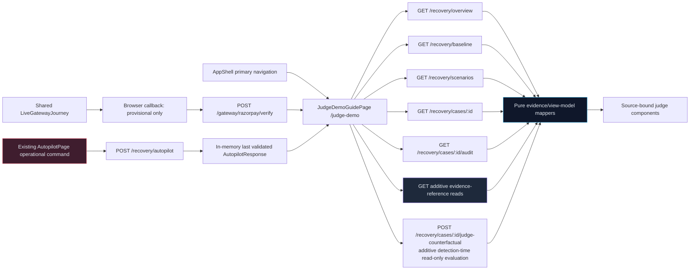
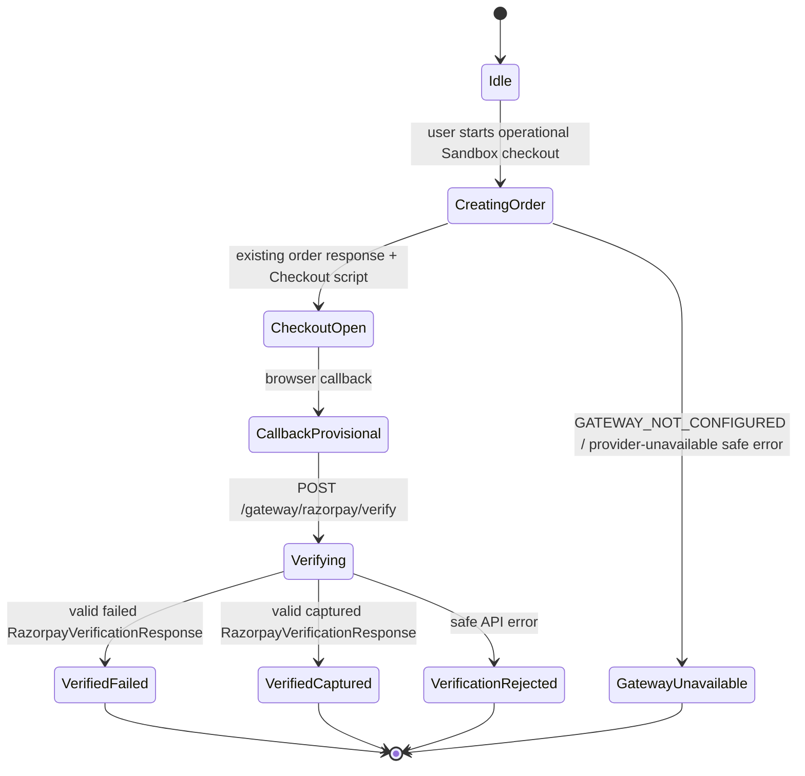

# Technical Design: Judge Demo Experience

## Overview

`judge-demo-experience` is an additive, evidence-first presentation layer for the existing RevivePay recovery system. It adds a single guided route and reusable presentation components; it does **not** add a recovery engine, decision path, policy rule, provider integration, model call, or browser-side economic calculation.

The browser remains a typed, read-only consumer of authoritative responses. Every displayed fact is either:

- a value from a validated existing response field; or
- a value from a validated, strictly additive evidence-reference read model that exposes a persisted relationship unavailable in current responses; or
- an unavailable-evidence state.

The feature deliberately excludes the existing Recovery Intelligence/AI-labelled UI and endpoints from the guide. The guide uses the deterministic `RecoveryCaseDetail`, audit, Strategy Lab, scenario, Autopilot, overview, baseline, and Razorpay verification contracts only. It must never turn a deterministic explanation, predictor, template, or fallback into an AI claim.

### Current-interface research findings

The design is based on the current workspace contracts rather than a parallel API:

- [Frontend route shell](../../../frontend/src/App.tsx) and [application navigation](../../../frontend/src/components/AppShell.tsx) provide lazy routes and primary navigation.
- [Frontend types](../../../frontend/src/types/api.ts), [typed route facade](../../../frontend/src/api/recovery.ts), and [runtime validators](../../../frontend/src/api/validators.ts) already establish the safe typed-response boundary.
- [Case detail and audit handlers](../../../app/api/routes/recovery.py) expose persisted diagnosis, action, latest outcome, and sequence-ordered immutable audit events.
- [Command Center handlers](../../../app/api/routes/command_center.py) expose overview, scenarios A–D, baseline comparison, the read-only Strategy Lab evaluation, and the existing mutating Autopilot command.
- [Gateway handler](../../../app/api/routes/gateway.py) returns a `RazorpayVerificationResponse` only after existing server-side signature verification and provider-state retrieval.
- [Policy audit](../../../app/services/policy_engine.py), [workflow transitions](../../../app/workflows/recovery_workflow.py), [outcome model](../../../app/models/recovery_outcome.py), and [Strategy Lab service](../../../app/services/strategy_lab.py) confirm the existing provenance and no-mutation boundaries.

No external research is needed: this feature is intentionally constrained to the repository’s existing source contracts and must not introduce a third-party service.

### Resolved design decisions

1. **Access-audit exception:** the current repository has no configured access-audit event type or access logger. Therefore, the new guide/read endpoints perform no writes. If an existing deployment later supplies an immutable access-audit facility, it may record an access entry only through that existing facility; it must not alter `Payment`, `RecoveryCase`, `RecoveryAction`, `RecoveryOutcome`, workflow `AuditEvent`, `GatewayWebhookEvent`, `PaymentAttempt`, or `VirtualClock`. This feature does not add an access-audit configuration or event type.
2. **Conditional Payment change:** the Guide, timeline, Strategy Lab presentation, and additive evidence-reference reads never mutate `Payment`. The existing `POST /gateway/razorpay/verify` retains its authoritative provider-verification behavior, including an existing provider-driven `Payment` update when it is invoked deliberately. No presentation endpoint or Counterfactual adds a new Payment mutation path.
3. **Global metric availability:** the judge money/recovery/uplift narrative is a single consistency group. If either validated `OverviewResponse` **or** validated `BaselineComparisonResponse` is missing, malformed, unreadable, or cross-source inconsistent, all global judge metrics render as unavailable evidence—never zero, cached, or partially synthesized. A missing evidence-reference index additionally disables the individual claim that needs that reference.
4. **No-execution proof:** the view displays the proof **if and only if** all evidence conditions in [Property 3](#property-3-policy-refusal-implies-no-execution-evidence) are true. It never infers skipped execution from a blocked label alone.
5. **Invalid data:** validators are the trust boundary. Invalid responses, missing required source fields, mismatched case/action identifiers, and contradictory evidence can only produce unavailable evidence; they cannot produce a claim, summary, or synthesized narrative.

### Scope and non-goals

In scope are guide composition, source locators, safe evidence loading, the provisional-to-verified gateway presentation, deterministic diagnosis display, ERV/Strategy Lab comparison, policy proof, money/baseline narrative, progressive Autopilot evidence, timeline, disclosures, and accessibility.

Out of scope are changes to the deterministic recovery workflow, Razorpay verification rules, normalizer, PolicyEngine, ERV calculator, Action Executor, Outcome Verifier, Autopilot behavior, Virtual Clock behavior, scenario seeding, baseline semantics, existing endpoint semantics, and all LLM/external-model capabilities. The guide does not call `getRecoveryIntelligence`, `simulateRecoveryIntelligence`, or add any model invocation.

## Architecture

### Boundary-preserving composition



The Guide only reads data by default. A guide control may link to an existing operational surface, but must identify itself as a user-initiated operational action before activation. The Guide never invokes `runCase`, `runAutopilot`, `advanceClock`, `resetDemo`, or a payment mutation during initial render or evidence navigation.

### Frontend source boundaries

| Existing boundary | Additive change | Responsibility retained |
| --- | --- | --- |
| `frontend/src/App.tsx` | Lazy-load `JudgeDemoGuidePage`; add route `/judge-demo`. | Existing routes and fallback behavior are unchanged. |
| `frontend/src/components/AppShell.tsx` | Add primary “Judge Demo Guide” navigation item and page metadata. Suppress the shell reset shortcut while on `/judge-demo`; the guide itself never makes reset a prerequisite. | Existing command-center navigation/reset behavior remains unchanged on other routes. |
| `frontend/src/types/api.ts` | Add only `JudgeCaseEvidenceReferencesResponse` and `JudgeOverviewEvidenceReferencesResponse` types; add their discriminated source-reference types. | Existing response interfaces and public field names remain unchanged. |
| `frontend/src/api/recovery.ts` | Add two GET wrappers for evidence references and `simulateJudgeCounterfactual`; reuse existing `getOverview`, `getBaselineComparison`, `getScenarios`, `getCase`, and `getCaseAudit`. | Existing endpoint wrappers, including `simulateStrategies`, retain their signatures. |
| `frontend/src/api/validators.ts` | Add complete runtime validators for the two new read models; strengthen gateway verification validation for every guide-required `payment` field before a gateway fact can render. | Invalid values continue entering the shared `ApiError` path. |
| `frontend/src/contexts/DemoDataContext.tsx` | Hold the latest validated `AutopilotResponse` in memory, clear it on demo reset, and expose read-only setter/clearer APIs to `AutopilotPage`. | No backend persistence or cache is created; a direct/reloaded Guide has no Autopilot result and shows unavailable evidence. |
| `frontend/src/pages/LiveGatewayDemoPage.tsx` | Extract the existing callback/verify state machine into a shared judge component/hook; retain the existing dedicated operational page. | Order creation and server verification retain their endpoint/security semantics. |
| `frontend/src/pages/AutopilotPage.tsx` | Publish its validated existing batch response to context and reuse `AgentStory` for its current progressive result presentation. | Only the existing explicit “Run Autopilot” action calls the mutating endpoint. |
| `frontend/src/pages/StrategyLabPage.tsx` | Reuse its existing read-only `simulateStrategies` flow where practical; do not import its intelligence panel into the Judge Guide. | The current Strategy Lab’s public behavior remains unchanged. |
| `frontend/src/components/ui.tsx`, `AuditTimeline.tsx` | Reuse cards, status badges, error states, focus styles, formatting utilities, and raw audit component patterns. Add separate judge components rather than weakening existing case-page behavior. | Existing Case Detail timeline continues to render as it does today. |

New frontend files are additive:

```text
frontend/src/pages/JudgeDemoGuidePage.tsx
frontend/src/components/judge-demo/Evidence.tsx
frontend/src/components/judge-demo/SourceLocator.tsx
frontend/src/components/judge-demo/DataSourceDisclosure.tsx
frontend/src/components/judge-demo/GuideSection.tsx
frontend/src/components/judge-demo/CommandCenterEvidence.tsx
frontend/src/components/judge-demo/LiveGatewayJourney.tsx
frontend/src/components/judge-demo/DeterministicDiagnosis.tsx
frontend/src/components/judge-demo/StrategyEvidence.tsx
frontend/src/components/judge-demo/PolicyEvidence.tsx
frontend/src/components/judge-demo/NoExecutionProof.tsx
frontend/src/components/judge-demo/AgentStory.tsx
frontend/src/components/judge-demo/JudgeAuditTimeline.tsx
frontend/src/components/judge-demo/evidenceViewModels.ts
frontend/src/components/judge-demo/evidenceViewModels.test.ts
```

`evidenceViewModels.ts` is the only place that combines validated response fields into display models. React components receive `Evidence<T>` values and do not access unvalidated transport payloads or compute policy/ERV/probability/outcome values.

### Backend source boundaries

| Existing boundary | Additive change | Must not change |
| --- | --- | --- |
| `app/api/routes/judge_demo.py` (new) | Register read-only `GET /recovery/cases/{case_id}/evidence-references`, `GET /recovery/overview/evidence-references`, and `POST /recovery/cases/{case_id}/judge-counterfactual`. | `GET /cases/{id}`, `GET /cases/{id}/audit`, overview, baseline, existing `/simulate`, and `POST /cases/{id}/run` contracts/behavior. |
| `app/schemas/judge_demo.py` | New response schemas for only missing evidence relationships and a detection-context wrapper around existing strategy values. | Existing `recovery.py` and `product.py` schema fields. |
| `app/services/judge_evidence.py` | Read-only data access/projection service; it follows persisted relations and emits references only. | No scorer, ERV calculator, policy evaluation, simulation, workflow, clock, or write call. |
| `app/services/strategy_lab.py` | Add `evaluate_at_detection` by factoring the existing scoring path so the new judge-only endpoint uses its existing persisted-detection-context helper, deterministic scorer, ERV calculator, PolicyEngine, and simulator projection. | The existing `evaluate` method and `/simulate` behavior/response values remain unchanged; no learned model or diagnosis agent is invoked. |
| `app/api/router.py` | Include the additive judge-demo router under the existing API prefix. | Existing route ordering and public paths. |
| `app/workflows/recovery_workflow.py` and `app/services/policy_engine.py` | Append optional source metadata required to establish a future action-to-policy-event relationship and diagnosis provenance. | Event type, sequence, timestamp, message, existing metadata keys, policy verdict, and workflow decisions. |

The audit metadata extension is narrowly additive:

- `DIAGNOSIS_COMPLETED.metadata.diagnosis_provenance = "RuleBasedDiagnosisEngine"` when that already-configured engine produced the persisted diagnosis.
- `POLICY_* .metadata.action_id = <existing RecoveryAction.action_id>` when the existing policy audit is written.

Historic events that lack these optional keys remain valid and render provenance/action linkage as unavailable. No historic row is rewritten, no audit event is inserted merely to make a screen complete, and no policy/business outcome changes.

### Strictly additive evidence-reference read models

Current `RecoveryCaseDetail.actions[]` lacks an action-to-outcome object and has no authoritative action-to-policy-audit sequence link. `OverviewResponse` has aggregate recovered/block/escalation values but no record references. `StrategyLabResponse` does not identify whether values were evaluated against a persisted detection-time context. Only these gaps need new typed read models.

```python
# app/schemas/judge_demo.py — conceptual contracts
class AuditEvidenceRef(BaseModel):
    case_id: str
    sequence: int
    event_type: AuditEventType
    metadata_path: str | None = None

class ActionEvidenceRef(BaseModel):
    action_id: str
    executed_at: datetime | None
    outcome: RecoveryOutcomeRead | None
    governing_policy_event: AuditEvidenceRef | None

class JudgeCaseEvidenceReferencesResponse(BaseModel):
    case_id: str
    diagnosis_provenance: AuditEvidenceRef | None
    diagnosis_fallback_provenance: AuditEvidenceRef | None
    action_evidence: list[ActionEvidenceRef]

class VerifiedOutcomeReference(BaseModel):
    case_id: str
    action_id: str
    outcome: RecoveryOutcomeRead

class PolicyVerdictReference(BaseModel):
    case_id: str
    action_id: str
    outcome: PolicyOutcome
    audit: AuditEvidenceRef

class JudgeOverviewEvidenceReferencesResponse(BaseModel):
    recovered_outcomes: list[VerifiedOutcomeReference]
    policy_blocks: list[PolicyVerdictReference]
    policy_escalations: list[PolicyVerdictReference]

class JudgeStrategyComparisonResponse(StrategyLabResponse):
    # All strategy/ERV/policy option fields retain the existing StrategyLabResponse shape.
    evaluation_basis: Literal['persisted_detection_time_context']
    evaluation_case_id: str
    read_only: Literal[True]
```

The two evidence-reference endpoints return no new totals, recommendations, decisions, calculations, or proof booleans. They only expose already-persisted relationships/identifiers that current typed responses do not carry. `JudgeOverviewEvidenceReferencesResponse` must emit only outcomes where `recovered is true` and `recovered_amount > 0`; the displayed aggregate remains the exact existing `OverviewResponse.revenue_recovered` value and is never recomputed in the browser.

`POST /recovery/cases/{case_id}/judge-counterfactual` is an additive, read-only wrapper required because the existing `/simulate` response lacks proof that it used a stored detection-time context. It calls only the factored existing Strategy Lab deterministic scorer, ERV calculator, PolicyEngine, simulator projection, and its existing persisted-detection-context reconstruction; it calls neither `RecoveryIntelligenceService` nor a diagnosis/model agent. Its strategy option values retain the existing `StrategyLabResponse` field names, while `evaluation_basis`, `evaluation_case_id`, `read_only`, `data_source`, and `notice` are the exact typed sources for the detection-context/read-only/projection disclosure. The existing `/simulate` endpoint and its current-context behavior remain untouched.

For `governing_policy_event`, the read service uses the immutable policy event’s additive `metadata.action_id`. If the field is absent, duplicated, does not match the action, or otherwise cannot identify a unique event, it returns `null`; the frontend displays incomplete evidence rather than guessing.

## Components and Interfaces

### Evidence and source-locator model

```ts
export type ApiFieldLocator = {
  kind: 'api-field';
  endpoint: string;          // e.g. GET /api/recovery/overview
  responseType: string;      // e.g. OverviewResponse
  fieldPath: string;         // e.g. revenue_recovered.amount
};

export type AuditFieldLocator = {
  kind: 'audit-field';
  endpoint: 'GET /api/recovery/cases/:caseId/audit';
  caseId: string;
  sequence: number;
  metadataPath?: string;     // e.g. limits.high_value_escalation_threshold
};

export type SourceLocator = ApiFieldLocator | AuditFieldLocator;

export type Evidence<T> =
  | { state: 'available'; value: T; sources: readonly [SourceLocator, ...SourceLocator[]] }
  | { state: 'unavailable'; reason: 'missing' | 'invalid' | 'inconsistent' | 'not-yet-returned' | 'not-applicable'; sources?: readonly SourceLocator[] };
```

`SourceLocator` renders human-readable endpoint/field text, is keyboard-focusable, and exposes the same text as an accessible description. It may deep-link to an existing case route or expand the matching audit event where a destination exists. It must never expose provider secrets, raw webhook content, callback signatures, contact details, or payment-instrument data.

Every mapper follows these rules:

1. Accept only values already accepted by runtime validators.
2. Check identifiers and required provenance before combining responses.
3. Return `Evidence.unavailable` on any missing/mismatched fact; do not use `0`, `false`, `null`, a browser-generated explanation, or a cached response as a substitute.
4. Use a closed enum formatter for `FailureReason`, `PolicyOutcome`, `ActionType`, and audit event types. No provider-description parsing or free-text failure inference occurs in the browser.
5. Preserve `Money` objects through mapping and pass them only to the locale formatter. The formatter may convert minor units for display but no guide code sums, subtracts, compares to select an action, or recalculates ERV.

### Page and section composition

`JudgeDemoGuidePage` renders these navigable sections in this exact order:

1. **Command Center** — `CommandCenterEvidence` loads overview and baseline as an all-or-unavailable pair and loads overview evidence references only for claims that need record links.
2. **Live Gateway Journey** — `LiveGatewayJourney` shares the existing checkout callback/verification state machine. Its checkout button is explicitly labelled “Operational: open Razorpay Sandbox Checkout”; source viewing itself is read-only.
3. **Deterministic Recovery** — `DeterministicDiagnosis` combines selected `RecoveryCaseDetail`, case audit, and case evidence references. It displays known normalized reason/category/transience/escalation/explanation only from fields supplied by those sources.
4. **Strategy Comparison** — `StrategyEvidence` uses additive `POST /recovery/cases/{id}/judge-counterfactual`, whose option fields reuse the existing Strategy Lab response shape and whose typed basis proves a read-only persisted detection-time evaluation. It has no execution control.
5. **Policy Governor** — `PolicyEvidence` combines the selected action, policy audit event, action evidence reference, and post-verdict audit range. `NoExecutionProof` is a pure predicate/output component.
6. **Autopilot** — `AgentStory` uses the in-memory, validated existing `AutopilotResponse` captured by the operational Autopilot page plus the typed `ScenariosResponse` and case audit. A direct load before a batch result is an unavailable evidence state with a link to the explicitly operational Autopilot page.
7. **Case Intelligence Timeline** — `JudgeAuditTimeline` sorts persisted audit events by `sequence` ascending and presents only nodes supported by current events/action/outcome data.

Every `GuideSection` includes a purpose, a `DataSourceDisclosure`, a safe evidence destination/next action, and a section-local unavailable state. Failure of one request does not prevent navigation to another section.

### Live Gateway provisional-to-verified state machine



- `CallbackProvisional` may show only the fact that a browser callback was received and that server verification is pending. It does not display/retain the callback signature, a payment result, provider status, normalized reason, Recovery Case link, verified recovery, or recovered revenue.
- `VerifiedFailed` may display only `RazorpayVerificationResponse.payment.status`, `payment.failure_reason`, `verified_provider_status`, and `recovery_case_id`, each with its exact field locator. It links to existing case evidence only when the returned case identifier is non-null.
- `VerifiedCaptured` displays the returned captured status and provider status, then stops. It makes no recovery/case/recovered-revenue claim.
- `VerificationRejected` displays the existing safe API error code/message. It renders no verified provider values or case link.
- A safe existing `GATEWAY_NOT_CONFIGURED` or provider-unavailable error marks this section unavailable without disabling deterministic sections.
- The shared component keeps raw callback values in function scope only long enough to submit verification; it never logs, displays, serializes, or stores the signature.

### Deterministic diagnosis and Strategy/ERV presentation

`DeterministicDiagnosis` displays `RecoveryCaseDetail.diagnosis.failure_reason`, `category`, `transience`, `requires_escalation`, and `explanation` only after a validated case response exists. It shows “diagnosis pending” when `diagnosis` is null. The rule-based label is shown only when the optional persisted/audited provenance reference explicitly identifies `RuleBasedDiagnosisEngine`; otherwise provenance is unavailable. A fallback label is shown only when the exact persisted fallback field exists. No component calls an LLM or labels a deterministic field as AI.

`StrategyEvidence` shows one row per exact `JudgeStrategyComparisonResponse.options[]` item; the wrapper preserves the existing `StrategyLabResponse` option field names while adding only typed detection-context/read-only provenance:

- action, probability, confidence, gross expected recovery, intervention cost, friction penalty, and `expected_recovery_value` come directly from the option’s named fields;
- the formula is explanatory text only: `ERV = recovery probability × payment amount − intervention cost − customer friction penalty`; the rendered ERV is the backend-returned minor-unit value;
- recommendation uses `recommended_action` and `recommendation_reason`, while eligibility uses each option’s `policy_outcome`, `eligible`, `policy_rule_id`, and `policy_reason`—these are separate labels;
- `is_candidate === false` produces “comparison-only alternative,” never an executable proposal;
- `simulation_basis`, top-level `data_source`, and `notice` produce the read-only synthetic projection disclosure;
- a null recommendation or missing required option field produces unavailable/no-recommendation evidence, never a promoted blocked/escalated action.

The same component supports a judge-facing Strategy Lab panel. It labels an override form as read-only before submission; renders only backend-returned `effective_settings`; preserves the last confirmed result on error; and never exposes action execution, clock advance, payment mutation, or approval override controls.

### Policy Governor and No-Execution Proof

`buildNoExecutionProof` is a pure mapper that takes a blocked/escalated action, its typed `ActionEvidenceRef`, the linked governing policy event, and the already validated ordered audit events.

```ts
function buildNoExecutionProof(input: ProofInput): Evidence<NoExecutionProofModel> {
  const governed = input.policy.outcome === 'BLOCKED' || input.policy.outcome === 'ESCALATED';
  const policyEvent = input.actionEvidence.governing_policy_event;
  const postVerdict = policyEvent
    ? input.audit.filter((event) => event.sequence > policyEvent.sequence)
    : null;
  const noExecutionEvent = postVerdict
    ? postVerdict.every((event) => event.event_type !== 'ACTION_EXECUTED' && event.event_type !== 'ACTION_FAILED')
    : false;

  if (governed && policyEvent && input.actionEvidence.executed_at === null
      && input.actionEvidence.outcome === null && noExecutionEvent) {
    return availableProof(/* governing sequence, executed_at locator, outcome inspection, audit range */);
  }
  return unavailableProof(/* missing or contradictory evidence */);
}
```

The implementation must not simplify the predicate, infer an absent outcome from a case state, or use the absence of a UI execution card as proof. The proof card names:

- the governing `POLICY_BLOCKED`/`POLICY_ESCALATED` audit sequence and metadata path;
- `RecoveryActionRead.executed_at` for the associated action;
- the action-specific `outcome` inspection from the new read model; and
- the inclusive post-verdict audit range inspected for `ACTION_EXECUTED`/`ACTION_FAILED`.

Scenario B locates its retry/budget stop rule in the policy audit metadata or returned policy response. Scenario C locates the high-value rule and human disposition in the same evidence class. Neither can offer an override.

### Command Center money and baseline narrative

`CommandCenterEvidence` requests overview and baseline concurrently but treats them as one required source group. Once both validate:

- at-risk, verified recovered, recovery rate, total ERV, approved ERV, and clock use exact `OverviewResponse` fields;
- baseline and RevivePay projected recovery, recovery-rate uplift, and ERV uplift use exact `BaselineComparisonResponse` fields;
- monetary values retain server `Money.amount` and `Money.currency` through locale-safe rendering only;
- the recovered claim is linked to the `OverviewResponse.revenue_recovered` field and each referenced `RecoveredOutcomeReference`; it is called recovered only when the referenced outcome says `recovered: true` and has nonzero amount;
- baseline uplift is always labelled “synthetic deterministic benchmark,” describes the shared scorer/valuation/PolicyEngine/simulator and different selection rule, and is never called actual recovered revenue;
- policy-block/escalation counts link to their overview/baseline field and associated immutable policy references.

The UI does not calculate a sum from outcome references to validate an overview figure. `OverviewResponse` remains the authoritative aggregate; reference entries provide inspectable provenance only.

### Progressive Autopilot and audit timeline

`AgentStory` reveals the already-returned `AutopilotResponse.results[]` in their returned `steps[].run_index` order. Animation affects only timing, not values or ordering. Every displayed selected action, policy outcome/rule, executor status, wait time, clock advance, recovery amount, message, and final state keeps a field locator to `AutopilotResponse`, `ScenariosResponse`, or the linked audit event.

- Scenario A displays `RETRY_LATER`, wait/schedule evidence, returned clock advance, and a recovered amount only when linked `VerifiedOutcome` evidence is available.
- Scenario B displays `BLOCKED`; it delegates to the same No-Execution Proof predicate.
- Scenario C displays escalation/human disposition and never a charge/recovery claim.
- Scenario D displays `CHANGE_PAYMENT_METHOD` and recovered amount only from verified outcome evidence.
- An `AutopilotCase.error` displays that exact error and suppresses synthesized completion/action/policy/wait/recovery facts.
- A `prefers-reduced-motion` user receives the same sequential evidence immediately without reveal animation. A polite `aria-live="status"` message announces each newly visible returned state and source-bound summary.

`JudgeAuditTimeline` uses `AuditTrailResponse.events` sorted by persisted `sequence` ascending. It maps only present event types to detection, diagnosis, options, decision, policy, schedule/execution, verification, recovery, and stop nodes. A decision node displays selected action, probability, confidence, ERV, alternatives, model version, and recorded explanation only from `RECOVERY_DECISION_SELECTED.metadata` or the matching latest `RecoveryActionRead` fields, with a locator for each value. A policy node displays evaluated action, rule, reason, and configured limits only from the policy response/action or policy-event metadata. A verification node distinguishes executor status from `RecoveryOutcomeRead`, and calls an amount recovered only when its identified outcome is `recovered: true` and nonzero. Missing expected events render an explicit missing-evidence node with no fabricated event type, message, or timestamp.

## Data Models

### Existing authoritative inputs

| Surface | Existing response fields used | Source disclosure |
| --- | --- | --- |
| Gateway verification | `RazorpayVerificationResponse.data_source`, `notice`, `payment.status`, `payment.failure_reason`, `verified_provider_status`, `recovery_case_id` | Server-verified Razorpay Sandbox; not live money. |
| Case/diagnosis | `RecoveryCaseDetail.diagnosis`, `latest_action`, `latest_explanation`, `latest_policy`, `latest_outcome`, `actions[]` | Persisted deterministic recovery evidence. |
| Audit | `AuditTrailResponse.events[].sequence`, `event_type`, `message`, `metadata`, `timestamp` | Immutable workflow evidence. |
| Strategy Lab | `StrategyLabResponse.data_source`, `notice`, `options[]`, `recommended_action`, `recommendation_reason`, `effective_settings` | Read-only synthetic projection. |
| Overview | `OverviewResponse.revenue_at_risk`, `revenue_recovered`, `recovery_rate`, ERV fields, counts, `virtual_clock_time` | Synthetic deterministic operational metrics. |
| Baseline | `BaselineComparisonResponse.baseline`, `revivepay`, uplift fields, `data_source`, `notice` | Synthetic benchmark, not actual recovery. |
| Scenarios | `ScenariosResponse.scenarios[]`, `virtual_clock_time`, `data_source`, `notice` | Seeded deterministic scenarios A–D. |
| Autopilot | `AutopilotResponse.results[]`, totals, `data_source`, `notice` | Existing deterministic batch response. |

### Response consistency rules

- A selected case ID must match across the case, audit, case evidence-reference, Strategy Lab, scenario, and Autopilot records before any combined claim renders.
- An action evidence reference must match an action returned by `RecoveryCaseDetail.actions[]`.
- A governing policy reference must point to an audit event for the same case and action, with matching policy outcome/rule where those values are rendered.
- A referenced outcome must match the action ID and the same case’s payment ID through the existing action relationship.
- Scenario labels use `DemoScenario.key`; the guide only applies its A/B/C/D explanatory label if the expected `case_id`, `expected_action`, and/or final state required for that label are present and valid.
- A global record reference may support a displayed claim only when its associated outcome/policy fields meet the claim’s predicate. It never supplies a replacement total.

Any failed rule produces `Evidence.unavailable` for the affected card/node. It does not invalidate unrelated guide sections unless it is one of the two globally required overview/baseline responses.

## Correctness Properties

*A property is a characteristic or behavior that should hold true across all valid executions of a system-essentially, a formal statement about what the system should do. Properties serve as the bridge between human-readable specifications and machine-verifiable correctness guarantees.*

### Requirements Coverage Reflection

The prework identified several overlapping requirements. The design consolidates rather than duplicates them:

- Gateway callback gating in Requirements 3.2–3.6 and 13.2, 13.3, 13.11 is one authority property.
- Metric equality/unavailability in Requirements 7.1–7.7 and 13.8 is one backend-value property.
- No-execution requirements 6.3–6.5, 8.6, and 13.5 are one iff predicate.
- Read-only Strategy Lab requirements 5.9, 10.2–10.8, and 13.7 are one referential-transparency property.
- Source binding, invalid-data behavior, Agent Story binding, and claim safety in Requirements 1, 4, 8, 9, 11, and 13 are one source-closure property.
- Guide visitation/A–D determinism is independently valuable and remains separate.

### Property 1: Gateway Verification Is the Only Live-Gateway State Authority

For any checkout callback or webhook fixture whose signature, provider retrieval, provider order relationship, provider payment relationship, amount, or currency validation fails, the before-and-after persisted sets of `PaymentAttempt`, `GatewayWebhookEvent`, and `RecoveryCase` records are equal. Any Judge Demo state for that fixture contains a verification failure and no verified `Provider_State`, normalized failure reason, or Recovery Case link; a callback alone remains provisional.

**Validates: Requirements 1.1, 3.2, 3.3, 3.4, 3.5, 3.6, 3.7, 3.9, 11.2, 11.6, 11.7, 13.2, 13.3, 13.4, 13.11**

### Property 2: Judge Metrics Preserve Backend Values

For every valid pair of overview and baseline response fixtures, every available Judge Demo money, percentage, count, policy-limit, and uplift value equals its named server-response field after locale-safe rendering. For all fixtures where either required global response is absent or invalid, every global judge money, recovery, and uplift value is unavailable. The presentation layer performs no derived monetary arithmetic beyond formatting returned `Money` values.

**Validates: Requirements 1.2, 1.4, 7.1, 7.2, 7.3, 7.4, 7.5, 7.6, 7.7, 11.3, 11.4, 13.8**

### Property 3: Policy Refusal Implies No Execution Evidence

For every Recovery Case whose associated Policy Governor outcome is `BLOCKED` or `ESCALATED`, a displayed No-Execution Proof exists if and only if the associated `RecoveryAction` has no execution timestamp, the associated action has no `RecoveryOutcome`, and the case audit sequence after the governing policy event contains neither `ACTION_EXECUTED` nor `ACTION_FAILED`. The proof must name the governing policy-event sequence, action execution field, outcome inspection, and post-verdict audit range.

**Validates: Requirements 6.1, 6.3, 6.4, 6.5, 6.6, 6.7, 6.8, 6.9, 8.5, 8.6, 8.7, 9.5, 9.6, 9.7, 11.5, 11.6, 11.7, 13.5, 13.6**

### Property 4: Read-Only Counterfactuals Are Referentially Transparent

For every valid `ScenarioOverrides` request and seeded Recovery Case, a before-and-after snapshot of `Payment`, `RecoveryCase`, `RecoveryAction`, `RecoveryOutcome`, `AuditEvent`, and `VirtualClock` is identical after Strategy Comparison or Counterfactual evaluation, except for a Payment state change required by an already-invoked existing authoritative backend flow and not by this presentation feature. Repeated requests with the same case, settings, seed, and clock time return equivalent options, policy verdicts, and recommendations.

**Validates: Requirements 1.3, 1.4, 1.5, 5.1, 5.2, 5.3, 5.4, 5.5, 5.6, 5.7, 5.8, 5.9, 10.1, 10.2, 10.3, 10.4, 10.5, 10.6, 10.7, 10.8, 13.1, 13.7**

### Property 5: Evidence-Bound Narratives Cannot Invent Facts

For any displayed diagnosis, decision, policy, execution, verification, timeline, metric, or Agent Story sentence, the view model contains at least one valid source locator naming an API response field or audit sequence and metadata field. For all absent, malformed, inconsistent, or unreadable referenced inputs, rendering uses unavailable evidence and does not generate a cause, model claim, action, probability, policy result, outcome, value, or provenance.

**Validates: Requirements 1.2, 1.6, 1.7, 2.3, 3.3, 3.4, 3.5, 3.6, 4.1, 4.2, 4.3, 4.4, 4.5, 4.6, 4.7, 4.8, 5.1, 5.2, 5.3, 5.4, 5.5, 5.6, 5.7, 5.8, 8.1, 8.2, 8.3, 8.4, 8.5, 8.6, 8.7, 8.8, 8.9, 8.10, 9.1, 9.2, 9.3, 9.4, 9.5, 9.6, 9.7, 9.8, 9.9, 11.1, 11.2, 11.3, 11.4, 11.5, 11.6, 11.7, 11.8, 11.9, 13.9**

### Property 6: Guided Demo Preserves Deterministic A–D Outcomes

For any reseed using the same simulation seed and Virtual Clock start time, visiting and navigating the Judge Demo Guide does not modify A–D scenario state. Running the existing Autopilot afterward produces the same A–D final states, selected actions, policy outcomes, recovered amounts, and audit event sequences as a run without a Guide visit.

**Validates: Requirements 1.8, 2.4, 2.5, 2.6, 2.7, 2.8, 8.3, 8.4, 8.5, 8.6, 8.7, 8.8, 8.9, 8.10, 8.11, 12.5, 12.6, 12.7, 12.8, 13.1**

## Error Handling

| Situation | Required presentation | Data-safety behavior |
| --- | --- | --- |
| Initial required response loading | Section-local skeleton with semantic busy status. | Do not render placeholder facts. |
| Gateway callback before verification | Provisional callback state. | Do not show verified payment/failure/case/outcome claims. |
| Gateway not configured/provider unavailable | Live Gateway unavailable card with safe returned error and a deterministic-section continuation. | Do not expose credentials or retry implicitly. |
| Gateway verification rejected | Error card with exact safe API error. | No verified status/reason/provider/case link; no new presentation claim. |
| Missing/invalid/inconsistent evidence | `UnavailableEvidence` card/nodal state with named failed source. | No zero/default/cached/generated substitute. |
| Overview or baseline invalid/missing | One global unavailable state for all judge business metrics. | No partial global money narrative. |
| Case/audit evidence missing | Preserve other independent guide sections and their source locators. | No inferred timeline/policy/diagnosis. |
| Strategy request validation/API failure | Preserve last confirmed read-only result, show exact error and retry-safe state. | Do not mark override applied or mutate/refresh case evidence. |
| Autopilot case error | Show returned error on the affected case only. | Do not synthesize final state, action, delay, policy, or amount. |
| Refresh fails after valid data | Preserve validated visible data and locators, announce error, render retry when safe. | Do not merge data from failed/invalid response. |

## Testing Strategy

### Test tools and boundaries

Property-based testing is appropriate only for the extracted pure source/evidence/view-model functions and the backend’s read-only evidence-reference projections. It is not used to test CSS layout, Razorpay itself, database wiring, or the mutating Autopilot workflow. Those use component, browser, and integration tests.

Implementation should add pinned test-only frontend packages `vitest@2.1.8`, `fast-check@3.23.2`, `@testing-library/react@16.1.0`, `jsdom@25.0.1`, and `@playwright/test@1.51.1`; frontend production dependencies remain unchanged. Backend property tests should add pinned `hypothesis==6.125.3` alongside the current pytest suite. Version pins must be recorded in the appropriate lockfile/requirements file during implementation, not introduced by this design-only change.

Each property test runs a minimum of 100 cases and includes the required tag comment:

```ts
// Feature: judge-demo-experience, Property 3: Policy refusal implies no execution evidence
```

### Proposed test files

| Test file | Test type | Coverage |
| --- | --- | --- |
| `frontend/src/components/judge-demo/evidenceViewModels.test.ts` | Vitest + fast-check, >=100 runs/property | Properties 1, 2, 3, and 5: callback gate, global metric all-or-unavailable gate, no-execution iff predicate, source closure, enum-only labels, no recovered claim without verified outcome. |
| `frontend/src/pages/JudgeDemoGuidePage.test.tsx` | Component tests | Ordered sections, navigation entry, section-local errors, global unavailable group, safe disclosures, no reset prerequisite, no action controls in read-only evidence cards. |
| `frontend/src/components/judge-demo/LiveGatewayJourney.test.tsx` | Component tests | Provisional callback, failed/captured/rejected states, source fields, no secret/PII in DOM/log/state, safe unavailable gateway branch. |
| `frontend/src/components/judge-demo/AgentStory.test.tsx` | Component + fast-check | Run-index ordering, response-field locators, error suppression, A–D fixtures, reduced-motion order, polite status announcement. |
| `frontend/src/components/judge-demo/JudgeAuditTimeline.test.tsx` | Component + fast-check | Sequence ordering, missing event states, execution-versus-outcome distinction, source locator expansion. |
| `frontend/e2e/judge-demo.spec.ts` | Playwright | Keyboard flow, 320px/768px behavior, responsive tables, focus indicators, disclosure reachability, no visual-only state information, reduced motion. |
| `tests/test_judge_demo_evidence.py` | pytest + Hypothesis, >=100 runs/property | Additive evidence-reference contract, action/outcome/policy linkage ambiguity, global reference integrity, immutability of GETs, optional access-audit exception. |
| `tests/test_razorpay_gateway.py` (extend) | Existing integration suite | Invalid signature/provider/order/payment/amount/currency leaves no records and no guide-eligible verification evidence. |
| `tests/test_command_center.py` (extend) | Existing integration suite | Overview/baseline exact field mapping, Strategy Lab no mutation/determinism, A–D outcomes unchanged after Guide reads. |
| `tests/test_workflow_e2e.py` and `tests/test_policy_engine.py` (retain/extend) | Existing integration suite | Policy blocks/escalations retain no execution/outcome events and additive audit metadata preserves existing fields/sequences. |

### Requirements traceability matrix

| Requirements | Primary implementation boundary | Primary validation |
| --- | --- | --- |
| 1 | Evidence types/mappers; additive reference reads | Source-closure and immutability properties |
| 2 | `JudgeDemoGuidePage`, `App`, `AppShell` | Ordered-route/component tests |
| 3 | Shared `LiveGatewayJourney`, gateway validator reuse | Gateway state-machine/component + existing gateway integration tests |
| 4 | `DeterministicDiagnosis`, case evidence reference | Diagnosis source-closure tests |
| 5 | `StrategyEvidence`, existing Strategy Lab API | Strategy exact-field/no-mutation properties |
| 6 | `PolicyEvidence`, `NoExecutionProof` | Iff property + policy/workflow integration snapshots |
| 7 | `CommandCenterEvidence`, overview reference read | Metric-preservation/global-unavailable property |
| 8 | `AgentStory`, in-memory batch handoff | Returned-step mapping, A–D fixtures, no Guide mutation |
| 9 | `JudgeAuditTimeline` | Sequence/missing-node/source-locator properties |
| 10 | Judge Strategy Lab panel | Read-only form/error-retention tests and database/clock snapshots |
| 11 | `DataSourceDisclosure`, `SourceLocator` | Provenance/recovered-claim property tests |
| 12 | Shared judge UI tokens and responsive components | Keyboard, semantics, motion, viewport, and contrast browser tests |
| 13 | Existing suites plus new judge tests | Full regression suite and security/snapshot tests |

### Validation sequence during implementation

1. Run backend unit/integration and new Hypothesis tests with `pytest`.
2. Run frontend unit/property tests once (non-watch) with `npm run test -- --run` after the test script is added.
3. Run `npm run typecheck` and `npm run build`.
4. Run the Playwright judge-demo suite at 320px and 768px, including keyboard and reduced-motion cases.
5. Re-run existing gateway, command-center, policy, audit, virtual-clock, Autopilot, Strategy Lab, scenario, and security suites to prove the feature remains additive.
