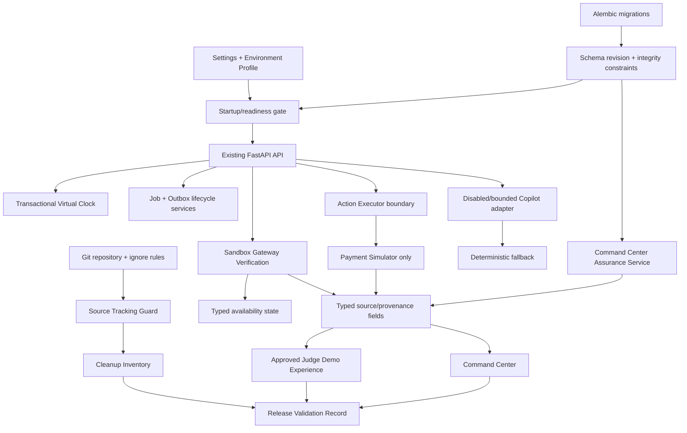

# Technical Design: Production Readiness Cleanup

## Overview

`production-readiness-cleanup` turns the existing RevivePay application into a reproducible, evidence-backed release candidate without replacing any authoritative recovery behavior. It is an additive remediation feature: deterministic diagnosis and scoring, Expected Recovery Value (ERV), Policy Engine decisions, the Payment Simulator, Outcome Verifier, immutable audit records, Virtual Clock, A–D scenarios, Command Center, Autopilot, Strategy Lab, Razorpay Sandbox verification, and the approved `judge-demo-experience` remain authoritative in their existing domains.

The work is intentionally ordered so that release evidence exists before cleanup decisions, persistence safety precedes concurrent execution, and presentation enhancements consume typed backend facts rather than reimplementing business logic. No browser surface, optional Copilot, Razorpay callback, or Command Center value may calculate, approve, execute, or verify recovery independently.

### Repository research findings

The design is based on the current repository rather than assumptions or external service behavior:

- `git status --short` confirms required runtime source is currently untracked, including `app/models/`, `app/integrations/razorpay.py`, `app/integrations/razorpay_failure_mapper.py`, `app/api/routes/gateway.py`, `app/schemas/gateway.py`, and their tests/frontend gateway integration. The root [`.gitignore`](../../../.gitignore) intentionally re-allows `app/models/` but excludes root `/models/`, so the tracking guard must distinguish those paths.
- Versioned migrations already exist through `20260829_03` in [`alembic/versions`](../../../alembic/versions), while [`app/db/init_db.py`](../../../app/db/init_db.py) still exposes `create_all()` and the destructive local [`demo.py`](../../../app/api/routes/demo.py) reset rebuilds schema directly. Production/staging must use migration/readiness checks instead.
- [`app/core/clock.py`](../../../app/core/clock.py) persists Virtual Clock state in an unlocked JSON file and intentionally falls back after corruption. This is suitable only for the documented single-process baseline and cannot satisfy the required concurrent, auditable clock semantics.
- [`app/core/config.py`](../../../app/core/config.py), [`app/api/auth.py`](../../../app/api/auth.py), and [`app/main.py`](../../../app/main.py) already centralize environment validation, API-key scopes, request-size limits, CORS, correlation IDs, security headers, and safe error envelopes. The remediation strengthens these established seams rather than adding route-local security.
- [`app/core/container.py`](../../../app/core/container.py) resolves only `PaymentSimulatorExecutor` for action execution. [`app/integrations/action_executor.py`](../../../app/integrations/action_executor.py) is a protocol boundary, not approval to add a provider executor. The design preserves simulator-only execution.
- [`app/services/gateway_payment_service.py`](../../../app/services/gateway_payment_service.py) already verifies signatures before authoritative provider retrieval and does not persist a rejected checkout verification. [`app/api/routes/gateway.py`](../../../app/api/routes/gateway.py) exposes the current Sandbox boundary.
- Durable models and a partial service exist in [`app/models/background_job.py`](../../../app/models/background_job.py), [`app/models/outbox_event.py`](../../../app/models/outbox_event.py), and [`app/services/job_service.py`](../../../app/services/job_service.py). Their lifecycle completion, lease reclaim, outbox delivery inspection, and database constraints must be finished rather than removed without review.
- [`app/services/analytics_service.py`](../../../app/services/analytics_service.py) already derives recovered revenue from verified outcomes only. [`app/api/routes/command_center.py`](../../../app/api/routes/command_center.py) remains the backend owner of dashboard calculations.
- The completed design and task plan for [Judge Demo Experience](../judge-demo-experience/design.md) and [its approved implementation plan](../judge-demo-experience/tasks.md) already define the evidence-first route, source locators, disclosures, and tests. This feature schedules that plan as a protected dependency; it does not redefine its route, view model, or contracts.

No external research is needed: Razorpay remains an injected, controlled-fixture boundary in tests, and no external AI or real provider executor is introduced by this design.

### Design decisions

1. **Track first, delete last.** Source Tracking Guard and a reviewed Cleanup Inventory are release prerequisites. Files are not removed based on visual navigation gaps or a one-off static search.
2. **Use Alembic as the sole staging/production schema authority.** `create_all()` stays only for explicit disposable local/test bootstrap paths. Startup validates revision compatibility before accepting operational mutations.
3. **Replace file-clock authority with transactional database authority.** A persisted per-scope clock plus ordered advance records gives locking, evidence, and concurrency equivalence; JSON is a one-time local migration input only.
4. **Complete rather than remove durable jobs/outbox.** They already form a supported operational boundary. Add explicit states, leases, result/failure summaries, idempotency, delivery records, and a bounded worker path. Removal is permitted only if the Cleanup Inventory proves no supported dependency remains, which the current repository does not establish.
5. **Keep Razorpay Sandbox verification separate from recovery execution.** Availability is an honest typed state; Sandbox verification can establish provider facts but cannot establish live-money recovery or invoke an Action Executor.
6. **Ship no Copilot provider.** The optional Copilot contract, bounded adapter interface, redaction, schema validation, audit projection, and deterministic fallback are implemented. The only registered runtime adapter is disabled; test fixtures may exercise a fake schema-conforming response. Enabling a future adapter requires a separate approved feature and environment review.
7. **Make provenance a closed typed value.** Every value shown as gateway, simulation, projection, recovered, or unavailable maps to a typed backend source and disclosure. Missing evidence becomes unavailable, never a zero, cached result, inferred cause, or fabricated claim.
8. **Reuse the Judge Demo implementation exactly once.** The production rollout invokes the approved `judge-demo-experience` task waves and its regression suite. Shared disclosure and source-locator primitives are reused by Command Center rather than forked.

## Architecture

### Boundary-preserving readiness architecture



The deterministic workflow, Policy Engine, Outcome Verifier, and immutable Audit Service retain their existing authority. New readiness services may query or gate those services, but cannot mutate decisions, policy outcomes, ERV values, simulation outcomes, or audit history to make a presentation complete.

### Dependency-safe delivery phases

| Phase | Scope and concrete boundaries | Dependencies and exit condition |
| --- | --- | --- |
| 0 — establish evidence | Add the Source Tracking Guard, baseline evidence record, cleanup-inventory schema, and release-record template. Track currently untracked required runtime source without changing behavior. | Must complete before any source removal or release claim. Guard identifies imports, routes, migrations, frontend build inputs, and test inputs. |
| 1 — contract/protection baseline | Snapshot protected API/workflow behavior; add typed environment profile/readiness configuration and standard error cases. | Existing backend/frontend regression baseline remains passing; no API field is removed or renamed. |
| 2 — persistence readiness | Add migrations, schema-readiness check, durable database Virtual Clock, and integrity constraints. Retain JSON clock only for approved local migration/bootstrap compatibility. | Upgrade both initialized and pre-remediation fixtures without data loss; wrong revisions reject mutations. |
| 3 — operational lifecycle | Finish jobs/outbox state machines, worker lease/reclaim behavior, transactional outbox recording, and bounded worker script/service. | Idempotent duplicate and concurrent-worker tests pass; no recovery work bypasses policy/executor/verifier. |
| 4 — external/safety boundaries | Add typed Razorpay availability, simulator-only executor hardening, bounded disabled Copilot framework, secret-exclusion checks, and environment authorization hardening. | Controlled fixtures prove safe unavailable/inconclusive outcomes, no provider execution, no secret exposure, and deterministic fallback. |
| 5 — evidence presentation | Execute the already-approved `judge-demo-experience` implementation plan unchanged; add Command Center assurance endpoint/cards using its shared disclosure/source-locator primitives. | Judge plan properties/browser tests pass; browser calculation or claim synthesis remains absent. |
| 6 — evidence-based cleanup/docs | Populate and review Cleanup Inventory; remove only eligible candidates; add operational/runbook documentation and release command wrappers. | Every removal has graph evidence plus protected-contract regression evidence. |
| 7 — release validation | Run repository tracking, migration upgrade/readiness, backend/property tests, frontend checks, browser tests, security scans, and release evidence generator. | A signed-off, non-secret record is `ready` only when every mandatory check passes. |

Phases may not be collapsed across their dependencies. In particular, cleanup cannot precede tracking, concurrent worker deployment cannot precede migration/clock validation, and the Judge Demo must retain its existing approved design rather than receive a parallel implementation here.

### Source-control tracking and cleanup architecture

Add the following additive release tooling:

- `scripts/source_tracking_guard.py`: discovers runtime source from Python imports and package initializers, FastAPI router inclusion, Alembic environment/revisions, scripts, frontend `package.json`/Vite/TypeScript inputs, static assets, and supported test command manifests. It asks Git for tracked status and effective ignore-rule provenance. It outputs a stable JSON report containing `path`, `discovery_evidence`, `tracked`, `ignored`, `matching_ignore_rule`, and `required`.
- `scripts/release_validate.py`: orchestrates non-mutating guard/test/build commands, writes a non-secret release record, and enforces baseline-count and critical-gate policy. It does not run a dev server or make network calls.
- `docs/release/baseline-evidence.md`: records the approved 595 backend-test baseline, frontend typecheck/build status, repository revision, command forms, and date. It is a comparison record, not an assertion that later tests must equal exactly 595.
- `docs/release/cleanup-inventory.md`: records each candidate, category, searched references, public-contract status, protected-capability relationship, tests, disposition, reviewer, and evidence gaps. A machine-readable companion `docs/release/cleanup-inventory.schema.json` validates entries.
- `docs/release/release-validation-template.md`: defines the evidence fields and required caveat text used by generated release records.

The guard classifies `app/models/**` as application source even though root `/models/` is ignored, reports the specific matching ignore rule for any required file, and treats unreadable files as a failure. It must be invoked against a clean checkout and a staged/working-tree report so untracked required source is visible before a release candidate is accepted.

### Migration and database-integrity architecture

Alembic remains the only versioned schema path for staging and production. The planned migration sequence is deliberately forward-only for release rollout:

1. **`20260829_04_readiness_integrity`** — adds explicit database constraints to supported existing records where preflight queries show no invalid rows; adds check/enum constraints for job state and attempt bounds; adds foreign keys for new/future writes from `RecoveryAction` to `RecoveryCase`, `RecoveryOutcome` to `RecoveryAction`, `AuditEvent` to `RecoveryCase`, `BackgroundJob` to its supported `RecoveryCase` aggregate, and `OutboxEvent` to its aggregate where the aggregate is `RecoveryCase`; preserves the existing unique audit `(case_id, sequence)`, job idempotency, outbox idempotency, and recovery/action authoritative keys. SQLite changes use Alembic batch operations; PostgreSQL uses normal transactional DDL.
2. **`20260829_05_virtual_clock_state`** — creates `simulation_clocks` and `clock_advance_events`, seeds the configured default scope from the legacy JSON state if present or `VIRTUAL_CLOCK_START` otherwise, and stores a row version/token. It does not rewrite recovery audit history.
3. **`20260829_06_job_outbox_lifecycle`** — adds bounded lifecycle/delivery fields and indexes needed for safe retries/reclaim/delivery inspection. Existing `PENDING`, `RUNNING`, `RETRY`, completed, and failed records are deterministically mapped after a preflight report; unknown legacy records block upgrade instead of being guessed.

`app/db/schema_readiness.py` (new) will compare Alembic current revision to the application-supported head and return a typed readiness result. `app/main.py` will invoke this check during staging/production lifespan startup before serving operational routes. `app/db/init_db.py` will explicitly reject schema-creating/bootstrap entry points for staging/production; it remains available only through documented local/test scripts. `app/api/routes/health.py` will expose a safe readiness state without connection strings, credentials, SQL text, or internal exceptions.

The existing destructive `POST /api/demo/reset` is retained only for explicit resettable profiles and will use a dedicated local/test schema reset helper. It never becomes a production or staging migration strategy.

### Authoritative Virtual Clock

`app/core/clock.py` evolves behind its existing `VirtualClock` interface. A new `DatabaseVirtualClock` implementation uses one `simulation_clocks` row per configured scope and a compare-and-swap/row-lock transaction:

1. validate nonnegative duration, authenticated principal, and supplied concurrency token when required;
2. lock or conditionally update the scope row by current version;
3. calculate `next_time = current_time + duration` inside the transaction;
4. increment the version and append one `ClockAdvanceEvent` with a unique ordered sequence, request/correlation ID, actor, prior/new time, duration, and safe reason;
5. commit, then return the exact authoritative time, version, and event ID.

Workflows continue to receive `VirtualClock` through [`app/core/container.py`](../../../app/core/container.py), so `RevenueRecoveryWorkflow`, `AutopilotService`, `AuditService`, and `PaymentSimulatorExecutor` do not receive wall-clock substitutes. `datetime.now()` remains allowable only for non-simulation job-worker lease processing; it is never used for simulation scheduling decisions.

### Gateway availability and execution boundaries

Introduce a read-only `GatewayAvailabilityService` and `GET /api/gateway/razorpay/availability` in [`app/api/routes/gateway.py`](../../../app/api/routes/gateway.py). It returns only:

- `availability`: `AVAILABLE`, `UNAVAILABLE`, or `INCONCLUSIVE`;
- `data_source`: typed server verification/configuration provenance;
- `observed_at` and a non-secret evidence identifier;
- a safe public `reason_code` and user-safe `notice`.

`UNAVAILABLE` means Razorpay Sandbox is disabled or required credentials are absent/invalid according to validated local configuration. `INCONCLUSIVE` means DNS, transport, timeout, or provider-integrity evidence could not establish availability; it is never presented as provider failure. `AVAILABLE` is emitted only after a successful existing `GatewayPaymentService.verify_checkout` result or a new authenticated, non-mutating adapter capability check. The capability check returns no provider payload to callers and has injected fixture coverage; tests never contact Razorpay.

[`app/services/gateway_payment_service.py`](../../../app/services/gateway_payment_service.py) continues to validate checkout/webhook signatures first, retrieve authoritative provider state second, and validate provider order/payment relationships, amount, and currency before any persisted application. Rejected verification rolls back and presents a safe standard error. The response/audit/log/browser allowlist excludes key secrets, webhook secrets, raw signatures, customer contacts, and payment-instrument credentials.

No `SafeProviderExecutor` is implemented in this feature. [`app/core/config.py`](../../../app/core/config.py) constrains execution to `simulator`, and [`app/core/container.py`](../../../app/core/container.py) accepts no provider executor registry key. Any future non-simulator setting fails closed at validation/resolution and records a safe block reason. Gateway success is verification evidence only; it must not call `ActionExecutor`, create a recovery execution, or establish recovered revenue without an independent persisted `RecoveryOutcome`.

### Optional bounded Copilot

Add a new internal boundary, not a provider integration:

- `app/schemas/copilot.py`: versioned `CopilotContext` allowlist and `CopilotResponseSchema`; fields are advisory summary/bullets, source references, schema version, safety status, and fallback reason only.
- `app/services/copilot_service.py`: `CopilotAdapter` protocol, `DisabledCopilotAdapter`, `CopilotContextRedactor`, schema validator, invocation/size/time bound checker, and deterministic-fallback selector.
- `app/core/config.py`: profile-scoped `copilot_enabled`, `copilot_max_request_bytes`, `copilot_max_response_bytes`, `copilot_timeout_ms`, and `copilot_max_invocations`. Defaults disable the Copilot in every profile.

No external model client, prompt store, paid service, or local generative model is added. A future adapter can only be registered after an independent reviewed feature supplies an explicit environment allowlist, bounded network destination, redaction proof, and audit/incident review. Until then, an enabled-but-unavailable adapter or any invalid/oversized/late/contradictory response produces `Deterministic_Fallback` from existing rule-based diagnosis, deterministic scorer, and fixed evidence templates.

The Copilot cannot select actions, alter ERV, change policy, execute, mutate payment/case/clock state, write a recovery audit event, or establish an outcome. If an interaction is recorded, the audit projection contains only `schema_version`, source/provenance class, safety status, fallback flag/reason, bounded usage counts, and correlation ID; it excludes prompts, secrets, contacts, instrument data, and provider payloads.

### Jobs and transactional outbox

The design completes the existing [`JobService`](../../../app/services/job_service.py), [`BackgroundJob`](../../../app/models/background_job.py), and [`OutboxEvent`](../../../app/models/outbox_event.py) rather than treating them as dead code.

`BackgroundJob` gains a closed status model: `PENDING`, `RUNNING`, `RETRY`, `COMPLETED`, `FAILED`, and `CANCELLED`; a safe `failure_summary`; a result summary; next-availability and lease fields; aggregate ID/type; idempotency key; request correlation ID; bounded attempt counters; and state-transition timestamp. `OutboxEvent` gains delivery state, attempts, delivery result/failure summary, next availability, lock/lease fields where required, and immutable originating-audit reference where applicable. Payloads remain allowlisted and non-secret.

`app/services/job_service.py` becomes a transactional state machine. `app/services/outbox_service.py` (new) creates outbox records in the same transaction as originating domain changes, claims/delivers them idempotently, and records delivery results without mutating originating audit events. A `scripts/worker.py` command (new) invokes the bounded claim/execute/deliver loop; it is not a web server and must be run explicitly by an operator/deployment process.

A duplicate job key returns the existing active/completed job. Claiming uses a conditional update and bounded lease; expiring leases are safely reclaimed according to retry limits; only one worker may complete a job. A terminal case cancels or completes pending work without recovery execution. Failure leaves inspectable evidence and cannot skip Policy Engine, Action Executor, or Outcome Verifier boundaries.

### Derived Command Center assurance values

Add an additive typed read model instead of altering existing dashboard fields:

- `app/schemas/assurance.py`: `AssuranceValue`, `AssuranceSourceRef`, `AssuranceStatus`, and `CommandCenterAssuranceResponse`.
- `app/services/assurance_service.py`: queries persisted outcomes, policy/action/audit records, job/outbox lifecycle records, clock state, and schema-readiness result; calculates values only from declared authoritative inputs.
- [`app/api/routes/command_center.py`](../../../app/api/routes/command_center.py): adds `GET /api/recovery/assurance`, or an additive `assurance` field to a versioned read model only after compatibility review. Existing `/overview` field names/semantics remain unchanged.
- `frontend/src/types/api.ts`, `frontend/src/api/recovery.ts`, and `frontend/src/api/validators.ts`: add validated response types/wrappers/guards. No assurance calculation enters browser code.

Every field has `status` (`AVAILABLE` or `UNAVAILABLE`), `value` when available, `derivation_label`, `data_source`, `observed_at`, and exact source references. Examples are verified recovered revenue (only `RecoveryOutcome.recovered=true` and positive amount), policy block/escalation evidence (persisted policy outcome plus audit), audit completeness (required persisted sequences, explicitly unavailable when missing), job/outbox health (lifecycle records), migration readiness (schema revision), and Virtual Clock integrity (persisted scope/event evidence). Synthetic or projection-derived values retain the required disclosure and never become real-performance claims.

### Real-versus-simulated presentation

The shared frontend provenance model has exactly four display classes:

| Typed source class | Required disclosure | Claim constraint |
| --- | --- | --- |
| `SERVER_VERIFIED_RAZORPAY_SANDBOX` | “Server-verified Razorpay Sandbox state — Sandbox does not move live money.” | Provider/payment facts only; not recovery or recovered revenue. |
| `SYNTHETIC_DETERMINISTIC_SIMULATION` | “Synthetic deterministic simulation — not real recovery performance.” | May show verified outcome within the simulation, but must retain simulation disclosure. |
| `READ_ONLY_SYNTHETIC_PROJECTION` | “Read-only synthetic projection — not actual recovered revenue.” | Never an execution or actual-recovery claim. |
| `UNAVAILABLE` | “Evidence unavailable; no claim can be shown.” | No inferred provenance, zero, cached estimate, or narrative substitute. |

The `recovered` label is permitted only for an identified persisted `RecoveryOutcome` with `recovered=true` and a nonzero amount. An executor acknowledgement is `execution-only`; a browser checkout callback is `provisional`; a strategy/baseline value is a projection. The Judge Demo implementation uses the approved `DataSourceDisclosure` and `SourceLocator` components. Command Center reuses these components rather than defining a second disclosure vocabulary.

### Environment-aware authorization and frontend quality

`Settings.environment` is normalized to a named profile: `local`, `demo`, `test`, `staging`, or `production`. `app/core/config.py` exposes a derived immutable profile policy, while [`app/api/auth.py`](../../../app/api/auth.py) remains the single principal/scope gate. Local/demo/test may use documented disabled development authentication and expose only the non-secret mode in operational status. Staging/production require non-empty approved-secret authentication, explicit CORS origins, and authenticated scoped principals for every Operational Mutation.

`operations:write` remains required for recovery/gateway operational actions, `demo:reset` remains dedicated to destructive reset, and new clock/job-worker operational routes receive explicit least-privilege scopes. Invalid credentials, missing scopes, malformed authorization, and disallowed origins use the existing standard error envelope and avoid configuration/credential/stack disclosure.

Frontend work extends the existing [`AppShell`](../../../frontend/src/components/AppShell.tsx), API validators, error boundary, UI primitives, and [`styles/index.css`](../../../frontend/src/styles/index.css). It executes the Judge Demo plan for route-specific behavior and applies the same quality contract to Command Center, Gateway, Autopilot, Strategy Lab, and case evidence: keyboard operation, visible focus, semantic labels, text/icon equivalents for states, WCAG AA token review, reduced-motion preservation of evidence order, polite status announcements, 320–767px one-column/reachable layouts, 768px+ comparison layouts, typed response validation, preserved verified evidence after safe refresh failure, and no secrets in DOM/storage/telemetry/client logs.

## Components and Interfaces

### Files to add or modify

| Area | Files | Change type and responsibility |
| --- | --- | --- |
| Source/release tooling | `scripts/source_tracking_guard.py`, `scripts/release_validate.py`, `docs/release/*` | New non-mutating graph guard, inventory/baseline/release records, and documented commands. |
| Settings/startup/security | `app/core/config.py`, `app/api/auth.py`, `app/main.py`, `app/api/routes/health.py`, `app/db/schema_readiness.py` | Add profile policy, fail-closed production/staging readiness, scopes, safe readiness response, and redaction-safe diagnostics. |
| Persistence/migrations | `alembic/versions/20260829_04_readiness_integrity.py`, `20260829_05_virtual_clock_state.py`, `20260829_06_job_outbox_lifecycle.py`, `app/db/init_db.py`, `app/models/*` | Ordered additive schema changes, integrity checks, clock records, lifecycle fields; no startup bootstrap in staging/production. |
| Clock | `app/core/clock.py`, `app/core/container.py`, `app/services/clock_service.py` (new), `app/api/routes/recovery.py` or a focused `clock.py` route | Retain interface; use transactional DB state, authorization, concurrency token, and evidence response. |
| Job/outbox | `app/models/background_job.py`, `app/models/outbox_event.py`, `app/services/job_service.py`, `app/services/outbox_service.py` (new), `app/api/routes/jobs.py`, `scripts/worker.py` | Complete lifecycle, idempotency, lease, atomic write/delivery, inspection routes, and explicit worker entrypoint. |
| Gateway | `app/integrations/razorpay.py`, `app/services/gateway_payment_service.py`, `app/services/gateway_availability.py` (new), `app/api/routes/gateway.py`, `app/schemas/gateway.py` | Add non-mutating availability boundary and typed safe response; preserve signature/retrieval semantics and no executor role. |
| Executor | `app/core/config.py`, `app/core/container.py`, `app/integrations/action_executor.py` | Lock registry/configuration to simulator; fail closed for any provider implementation. |
| Copilot | `app/schemas/copilot.py` (new), `app/services/copilot_service.py` (new), `app/core/config.py`, `app/services/audit_service.py` | Disabled adapter, allowlist/redaction/schema/bounds/fallback; no external client. Existing AI diagnosis components are neither granted authority nor relabelled. |
| Assurance | `app/schemas/assurance.py` (new), `app/services/assurance_service.py` (new), `app/api/routes/command_center.py` | New source-closed assurance read model; do not change existing overview calculations. |
| Judge Demo | Files named in [approved Judge Demo tasks](../judge-demo-experience/tasks.md) | Implement that plan verbatim as a dependent workstream; do not create a competing guide or endpoint set. |
| Frontend integration | `frontend/src/App.tsx`, `frontend/src/components/AppShell.tsx`, `frontend/src/types/api.ts`, `frontend/src/api/recovery.ts`, `frontend/src/api/validators.ts`, `frontend/src/pages/ExecutiveDashboard.tsx`, `frontend/src/components/*` | Add validated assurance display and reuse approved source/provenance/accessibility components; preserve legacy routes/fields. |
| Documentation | `README.md`, `docs/deployment.md`, `docs/razorpay-sandbox.md`, `docs/operations.md` (new), `docs/release/*` | Update architecture, profiles, migration, worker/outbox, availability, assurance, cleanup, release, and mutation preconditions without secret examples. |

### API contracts

All additions preserve existing routes, response fields, error envelopes, and behavior. Newly introduced routes are additive and use the existing `{ "error": { "code", "message" } }` error shape.

```text
GET  /api/gateway/razorpay/availability
GET  /api/recovery/assurance
GET  /api/clock/{scope}                    # read-only authoritative time
POST /api/clock/{scope}/advance            # scoped Operational Mutation
GET  /api/jobs/{job_id}                    # expanded safe lifecycle read
GET  /api/outbox/{event_id}                # optional safe inspection read
```

`POST /api/clock/{scope}/advance` requires the configured clock scope, authenticated mutation scope outside local/demo/test, nonnegative duration, and a concurrency token where the profile requires it. Its response contains `previous_time`, `current_time`, `version`, and `clock_advance_event_id`; it contains no internal lock or database detail.

`GatewayAvailabilityResponse` does not echo key ID, secret, URL credentials, callback payload, or raw provider response. `CommandCenterAssuranceResponse` returns only declared source locators and sanitized values. Copilot routes are not exposed while the only adapter is disabled; if an advisory read endpoint is later added, it must consume the schema above and return a deterministic fallback whenever an enablement/safety gate is not met.

## Data Models

### New or extended persisted models

| Model | Key fields/invariants | Notes |
| --- | --- | --- |
| `SimulationClock` | `scope` unique; `current_time`; `version`; `updated_at`; `updated_by` | One authoritative row per simulation scope; replaces JSON as runtime authority after migration. |
| `ClockAdvanceEvent` | event ID; scope; unique ordered sequence per scope; previous/current time; nonnegative duration; version before/after; correlation ID; actor; safe reason; timestamp | Provides linearization evidence; append-only. |
| `BackgroundJob` (extended) | closed status; aggregate type/ID; idempotency key; attempts/max attempts; availability; lease owner/expiry; correlation; result/failure summaries | Existing idempotency remains unique. State checks/foreign key/invariants are added after migration preflight. |
| `OutboxEvent` (extended) | aggregate; unique idempotency key; delivery status/attempts; lease; availability; result/failure summary; delivered time | Created transactionally with domain changes; delivery does not modify originating immutable audit event. |
| Existing recovery/audit records | explicit foreign keys/unique constraints as stated in Requirement 10; optional allowlisted metadata only | No historical audit rewrite, no altered decision/policy/outcome semantics. |

`AuditEvent` remains immutable. New optional metadata keys are namespaced and additive; the existing Judge Demo plan’s `diagnosis_provenance` and `action_id` metadata extension remains valid. Historic events lacking those keys produce unavailable evidence, not backfilled claims.

### Typed read and configuration models

```python
class DataSourceClass(str, Enum):
    SERVER_VERIFIED_RAZORPAY_SANDBOX = "SERVER_VERIFIED_RAZORPAY_SANDBOX"
    SYNTHETIC_DETERMINISTIC_SIMULATION = "SYNTHETIC_DETERMINISTIC_SIMULATION"
    READ_ONLY_SYNTHETIC_PROJECTION = "READ_ONLY_SYNTHETIC_PROJECTION"
    UNAVAILABLE = "UNAVAILABLE"

class GatewayAvailabilityResponse(BaseModel):
    availability: Literal["AVAILABLE", "UNAVAILABLE", "INCONCLUSIVE"]
    data_source: DataSourceClass
    observed_at: datetime
    evidence_id: str | None
    reason_code: str
    notice: str

class AssuranceValue(BaseModel):
    status: Literal["AVAILABLE", "UNAVAILABLE"]
    value: Money | int | float | str | None
    derivation_label: str
    data_source: DataSourceClass
    observed_at: datetime
    sources: list[AssuranceSourceRef]
    unavailable_reason: str | None

class CopilotResponseSchema(BaseModel):
    schema_version: Literal["1"]
    advisory_summary: str
    evidence_refs: list[SafeEvidenceRef]
    safety_status: Literal["ADVISORY_ONLY"]
```

The response union for every display-capable evidence value follows the Judge Demo plan’s `Evidence<T>` pattern: `available` requires at least one exact typed API/audit source locator; `unavailable` carries only a safe reason. Browser code may locale-format returned `Money` but may not derive monetary totals, recovery probabilities, ERV, policy outcomes, outcomes, or provenance.

### Compatibility rules

- Existing `OverviewResponse`, `RazorpayVerificationResponse`, workflow responses, and error envelopes are extended only after schema/validator compatibility tests; existing required fields remain unchanged.
- Existing JSON Virtual Clock state is read once during migration/local bootstrap and then treated as a deprecated compatibility input. If it is malformed, migration/readiness fails safely rather than silently resetting a staging/production timeline.
- Existing job/outbox rows are mapped only where their meaning is deterministic. Unknown or invalid rows block migration with an operator-readable non-secret remediation report.
- Schema revision is not inferred from table presence in staging/production. Alembic state is authoritative.

## Correctness Properties

*A property is a characteristic or behavior that should hold true across all valid executions of a system-essentially, a formal statement about what the system should do. Properties serve as the bridge between human-readable specifications and machine-verifiable correctness guarantees.*

### Requirements Coverage Reflection

The prework found that several clauses describe the same universal boundary and should not create redundant tests:

- Runtime discovery, ignore handling, required tracking, and test-count policy combine into one release-input property.
- Cleanup reference checks consolidate into one retention/eligibility property; actual removals remain integration tests.
- Gateway availability, verification rejection, and no fabricated claim combine into a single controlled-provider property.
- Simulator-only configuration and all unsafe future-provider cases combine into one executor fail-closed property.
- Copilot redaction, schema/bounds, fallback, and non-authority combine into one bounded-advisory property.
- Clock arithmetic, ordering, and concurrent-equivalence combine into one linearizability property.
- Job claim/retry/completion/cancellation and outbox idempotency combine into one lifecycle property.
- Provenance labels, recovered-claim gates, Judge Demo source closure, and assurance unavailable behavior remain separate: one protects presentation classification, the other protects backend-derived assurance values.

### Property 1: Runtime Source and Release Baseline Are Closed

For any supported startup, API-route, migration, frontend-build, or test manifest, every discovered Runtime Source is reported with discovery evidence and must be tracked by Git without an effective ignore rule. For all release test counts below 595, release readiness is false unless a complete reviewed replacement-coverage record identifies the removed test and equivalent retained coverage.

**Validates: Requirements 1.1, 1.2, 1.3, 1.4, 1.5, 1.6, 1.7, 15.1, 17.1, 17.2, 17.5, 17.7**

### Property 2: Cleanup Classification Fails Closed

For any cleanup candidate and repository reference evidence, the candidate is eligible for removal only when no runtime, public HTTP, migration, configuration, documentation-command, test, or Protected Capability reference exists; any present, incomplete, conflicting, or unreadable evidence classifies it as retained with the reason recorded.

**Validates: Requirements 2.1, 2.2, 2.3, 2.4, 2.6, 2.7**

### Property 3: Unchanged Deterministic Recovery Is Stable

For any unchanged seeded payment, configuration, simulation seed, and authoritative Virtual Clock time, the remediation build produces the same deterministic decision, Policy Engine result, ERV, Payment Simulator result, Outcome Verifier result, and increasing per-case Audit Event sequence as the preserved baseline build.

**Validates: Requirements 3.1, 3.3, 15.2**

### Property 4: Evidence Claims Are Provenance-Closed

For any displayed gateway, simulation, projection, Command Center, or Judge Demo amount or statement, the display has an exact validated typed API/audit source locator and a matching source class. A recovered label appears if and only if an identified persisted Verified Outcome has `recovered=true` and a nonzero recovered amount; invalid, missing, or inconsistent provenance produces unavailable evidence and no generated claim.

**Validates: Requirements 4.3, 4.4, 4.5, 4.6, 4.8, 5.1, 5.2, 5.3, 5.4, 5.5, 5.6, 5.7, 5.8, 13.8, 13.9, 13.10, 14.10, 15.7**

### Property 5: Gateway Availability and Rejection Never Manufacture Facts

For any controlled Razorpay configuration and provider fixture, `AVAILABLE` occurs only after a safe authenticated non-mutating capability result or successful existing gateway verification; absent/invalid/disabled credentials yield `UNAVAILABLE`; reachability or provider-integrity uncertainty yields `INCONCLUSIVE`. For every rejected signature, retrieval, relationship, amount, or currency verification, the before-and-after sets of Gateway Webhook Events, Payment Attempts, and Recovery Cases are equal, and no verified provider state, failure reason, case reference, or recovery claim is emitted.

**Validates: Requirements 3.2, 6.1, 6.2, 6.3, 6.4, 6.5, 6.6, 6.7, 6.8, 6.9, 15.3, 15.4**

### Property 6: Executor Configuration Fails Closed to the Simulator

For any Environment Profile in which a Safe Provider Executor is absent, disabled, unauthorized, incomplete, or otherwise invalid, the Action Executor boundary resolves to the Payment Simulator or rejects provider execution before invocation. It produces no provider operation and no recovered claim without an independently identified Verified Outcome.

**Validates: Requirements 7.1, 7.2, 7.3, 7.4, 7.5, 7.6, 7.7, 15.5, 17.7**

### Property 7: Copilot Is Redacted, Bounded, and Non-Authoritative

For any supplied Copilot context or response, only allowlisted/redacted context may cross the adapter boundary; only a schema-valid, in-bound, non-contradictory advisory response may display. For all disabled, unavailable, malformed, oversized, timed-out, over-count, unallowlisted, or contradictory responses, deterministic fallback is displayed with a safe reason, and recovery, policy, payment, clock, audit, and outcome state remains unchanged.

**Validates: Requirements 8.1, 8.2, 8.3, 8.4, 8.5, 8.6, 8.7, 8.8, 15.6**

### Property 8: Environment Security and Release Gates Fail Closed

For any profile/configuration/principal/request combination, production/staging cannot start or accept an Operational Mutation unless required security configuration, authentication, authorization scope, schema readiness, CORS/origin, and request-bound conditions are valid. Safe error envelopes never contain supplied credentials, configured secrets, stack traces, or internal configuration values.

**Validates: Requirements 9.1, 9.3, 9.4, 9.5, 9.6, 9.7, 9.8, 9.9, 10.2, 10.4, 17.5, 17.7**

### Property 9: Clock Advances Are Linearizable

For any finite collection of accepted nonnegative Clock Advance Requests targeting one scope, the final authoritative time equals the initial time plus the sum of accepted durations and equals the result of applying the requests in persisted event-sequence order. Invalid durations, stale tokens, and unauthorized requests leave time unchanged; each accepted request has one unique ordered evidence record.

**Validates: Requirements 10.3, 11.1, 11.2, 11.3, 11.4, 11.5, 11.6, 11.7, 15.1**

### Property 10: Job and Outbox Lifecycles Preserve Idempotency and Safety

For any repeated supported job submission or outbox publication with the same idempotency identity, at most one represented active/completed operation or delivered effect exists. For every valid lifecycle transition, leases, retry bounds, terminal-case cancellation, result/failure evidence, and originating immutable audit content remain consistent; unsafe processing never bypasses Policy Engine, Action Executor, or Outcome Verifier.

**Validates: Requirements 10.5, 10.6, 10.7, 10.8, 12.1, 12.2, 12.3, 12.4, 12.5, 12.6, 12.7, 12.8, 12.9, 12.10, 12.11, 12.12**

### Property 11: Assurance Values Are Source-Closed

For any authoritative recovery, policy, audit, job, outbox, migration, and clock record set, each available Command Center Assurance Value equals the result of its declared backend derivation and has typed source references, source class, derivation label, and observation time. If any required source is missing, malformed, or inconsistent, the value is unavailable and browser rendering supplies no default, cached, or recalculated replacement.

**Validates: Requirements 13.1, 13.2, 13.3, 13.4, 13.5, 13.6, 13.7, 13.8, 13.9, 13.10, 15.8**

### Property 12: Release Readiness Requires Every Mandatory Evidence Check

For any release-check result map, the release is ready if and only if every mandatory source-tracking, baseline-coverage, migration/schema, security, executor, backend, frontend, targeted regression, and documentation check passes. A ready record retains the required synthetic/Sandbox/projection limitations and never claims real payment recovery performance.

**Validates: Requirements 15.10, 15.11, 16.1, 16.2, 16.3, 16.4, 16.5, 16.6, 16.7, 16.8, 17.1, 17.2, 17.3, 17.4, 17.5, 17.6, 17.7**

## Error Handling

| Condition | Backend behavior | Presentation/release behavior |
| --- | --- | --- |
| Required source untracked, ignored, missing, unreadable | Guard emits path, discovery evidence, and matched ignore rule when applicable; exits nonzero. | Release record is not ready; no cleanup/removal proceeds. |
| Cleanup evidence missing/conflicting | Inventory records `RETAINED_INCOMPLETE_EVIDENCE`; no deletion operation is authorized. | Review record identifies gap without declaring code dead. |
| Wrong/missing/ahead schema revision | Readiness returns a safe `SCHEMA_NOT_READY`/compatibility error; staging/production deny mutations. | Health/readiness reports unavailable safely; release blocks. |
| Integrity violation/migration preflight failure | Transaction rolls back; migration halts with sanitized operator detail. | No partial recovery state; release blocks until remediated. |
| Clock invalid/stale/unauthorized/concurrent request | Reject with standard error; no time change. Contention can be retried only with a fresh token. | Display last verified time/source, then safe retry guidance where authorized. |
| Job/outbox duplicate, lease conflict, unsafe failure | Return existing record or safe contention response; retain lifecycle/failure evidence. | Never imply duplicate execution or delivered effect. |
| Razorpay configuration absent | Availability is `UNAVAILABLE` with no secret/config details. | Gateway card stays available as an unavailable evidence state; deterministic flow remains usable. |
| Razorpay transport/remote-integrity uncertainty | Availability is `INCONCLUSIVE`; verification reports safe provider-unavailable error. | Do not claim a provider pass/failure, case, payment status, or recovery. |
| Razorpay signature/provider/relationship validation failure | Reject and roll back; no webhook/attempt/case creation attributable to the rejected interaction. | Callback remains provisional or displays safe verification failure only. |
| Unsafe provider executor setting | Configuration/container fails closed before provider call. | Release not ready if enabled in a protected profile; no recovery claim. |
| Copilot disabled/invalid/unsafe | Redactor/validator/bound checker chooses deterministic fallback and sanitized audit projection. | Show fallback/source limitation; never invent a Copilot answer. |
| Invalid typed frontend evidence/API refresh failure | Validators raise existing API error; view model preserves prior validated facts and locators. | Section-local accessible error/unavailable state with safe retry; no fabricated substitute. |
| Auth/scope/origin/request-limit failure | Existing standard safe error envelope, correlation ID, and security headers. | No credentials, stack traces, or configuration values appear. |

## Testing Strategy

### Test approach

Property-based testing is appropriate for pure graph/classification, provenance/claim, configuration, redaction/schema, transition, derivation, and deterministic arithmetic logic. It is not used to test Razorpay itself, CSS layout, browser rendering quality, database driver behavior, or live provider/network behavior. Those remain controlled-fixture integration or browser tests.

Use `hypothesis==6.125.3` for Python property tests and the pinned `fast-check@3.23.2` already specified by the approved Judge Demo plan for TypeScript view-model tests. Each property test executes at least 100 generated cases and is tagged, for example:

```python
# Feature: production-readiness-cleanup, Property 9: Clock advances are linearizable
```

### Proposed test coverage

| Area | Target tests | Primary validation |
| --- | --- | --- |
| Source guard and cleanup | `tests/test_source_tracking.py`, `tests/test_cleanup_inventory.py`, temporary-Git fixtures | Required-source discovery, ignore provenance, baseline count policy, fail-closed classification. |
| Protected contracts | `tests/test_contract_baseline.py`, retained `test_workflow_e2e.py`, `test_policy_engine.py`, `test_command_center.py` | Seeded decision/policy/simulator/outcome/audit equality and stable response fields/error envelope. |
| Migrations/readiness | extend `tests/test_migrations.py`; add `tests/test_schema_readiness.py` | Upgrade from initialized/pre-remediation fixtures; bad revision blocks mutations; no staging/production `create_all`. |
| Database integrity | `tests/test_models.py`, `tests/test_integrity_constraints.py` | Unique/FK/check atomic rejection and immutable audit ordering. |
| Clock | `tests/test_virtual_clock_concurrency.py` | 100+ generated request sets plus concurrent transactional workers, stale tokens, and no wall-clock workflow decisions. |
| Jobs/outbox | extend `tests/test_jobs.py` or add `tests/test_job_outbox_lifecycle.py` | State machine, duplicate submission, claim contention, expiry, cancellation, transactional outbox, audit non-mutation. |
| Gateway | extend `tests/test_razorpay_gateway.py`; add `tests/test_gateway_availability.py` | Signature/retrieval/relationship rejection, no rejected side effects, AVAILABLE/UNAVAILABLE/INCONCLUSIVE, sentinel-secret exclusion. |
| Executor/Copilot/security | `tests/test_executor_boundary.py`, `tests/test_copilot_boundary.py`, `tests/test_environment_security.py` | Simulator-only configuration, redaction/schema/bounds/fallback/no mutation, profile/startup/scopes/CORS/header/error safety. |
| Assurance | `tests/test_assurance_service.py`, `tests/test_command_center.py` | Source-closed derivation, unavailable behavior, no browser calculation, synthetic/projection disclosure. |
| Judge Demo | Exact files and suites in [Judge Demo testing strategy](../judge-demo-experience/design.md#testing-strategy) | Execute existing approved property/component/Playwright tests; do not duplicate test scenarios or source models. |
| Frontend quality | Judge Demo Playwright suite plus `frontend/e2e/command-center-readiness.spec.ts` | Keyboard/focus/semantics/status, 320/768px layouts, reduced motion, contrast, source locators, retained evidence/retry. |
| Documentation/release | `tests/test_release_docs.py`, `tests/test_release_validation.py` | Required safe wording, mutation preconditions, no secrets, command manifests, release-record fail/ready gate. |

All backend tests use injected Razorpay and Copilot fixtures, temporary Git/database directories, and no outbound network. Browser tests run once, never in watch mode. The existing backend suite may grow beyond 595 tests; release validation fails only when it drops below 595 without the required reviewed replacement record.

### Validation and rollout order

1. Run Source Tracking Guard and record/track all required current runtime sources before touching cleanup candidates.
2. Capture protected-contract snapshots; run current backend suite, frontend `typecheck`, and production `build` to reaffirm the recorded baseline.
3. Apply migrations to a disposable initialized database, then a pre-remediation fixture; verify readiness and rollback limitations before staging.
4. Enable database Virtual Clock and job/outbox worker path in test/local first; run concurrency/idempotency/property suites with at least 100 cases each.
5. Enable profile/security/gateway-availability/Copilot boundaries in test/local using controlled adapters only. Do not enable a provider executor or external Copilot.
6. Implement the approved Judge Demo task plan, then add assurance display via its shared disclosure/source-locator components; run unit/property/component/browser tests.
7. Populate Cleanup Inventory, remove only reviewed eligible candidates one small change at a time, and rerun associated protected-contract suites after each removal.
8. Update README/deployment/Sandbox/operations/release documentation, including reset/mutation scope and environment prerequisites.
9. Run the final one-shot validation set: source tracking, cleanup inventory validation, `alembic upgrade head` fixtures, migration/readiness/integrity/clock/job/outbox/auth/gateway/executor/Copilot/assurance/Judge Demo tests, full `pytest`, frontend test run, `npm --prefix frontend run typecheck`, `npm --prefix frontend run build`, and Playwright responsive/accessibility checks.
10. Generate the non-secret release record with repository revision, environment, schema revision, exact command results, passing count, duration, failures/skips, source tracking report, cleanup disposition, and explicit limitations. Mark it ready only after all mandatory checks pass.

## Documentation and operational runbooks

`README.md` becomes a concise architecture/quick-start entry point. `docs/deployment.md` is updated with profile matrix, migration/readiness procedure, rollout/rollback limitations, worker process expectations, and release commands. `docs/razorpay-sandbox.md` gains the three availability meanings and the statement that unavailable/inconclusive does not prove failure or success. `docs/operations.md` documents job/outbox states, lease recovery, idempotency, failure inspection, assurance values, Virtual Clock concurrency, Copilot fallback, and safe operational mutation prerequisites.

All documented commands that mutate state—migration, demo reset, clock advance, job submission/worker execution, gateway order creation/verification—must be labelled **Operational Mutation**, identify permitted environments, required scopes, idempotency/concurrency expectations, and non-secret configuration assumptions. No document includes a secret, raw provider payload, customer contact, instrument data, or bypass instruction.

## Acceptance traceability

| Requirement group | Design coverage |
| --- | --- |
| 1–3: source tracking, cleanup, preservation | Source-control architecture; Phases 0/1/6; Properties 1–3; contract/guard tests. |
| 4–5: Judge Demo and claim integrity | Judge-plan dependency; provenance model; Property 4; Judge Demo regression suite. |
| 6–8: Sandbox, executor, Copilot | Gateway/executor/Copilot boundaries; Properties 5–7; controlled-fixture tests. |
| 9–10: profile security, migrations, integrity | Environment/security and migration architecture; Property 8; readiness/integrity tests. |
| 11–12: clock, jobs, outbox | Transactional clock and lifecycle architecture; Properties 9–10; concurrent database tests. |
| 13–14: assurances and frontend quality | Assurance service/read model and shared UI contract; Properties 4/11; browser tests. |
| 15–17: regression, documentation, release | Test strategy, runbooks, rollout, Property 12, generated release record. |
