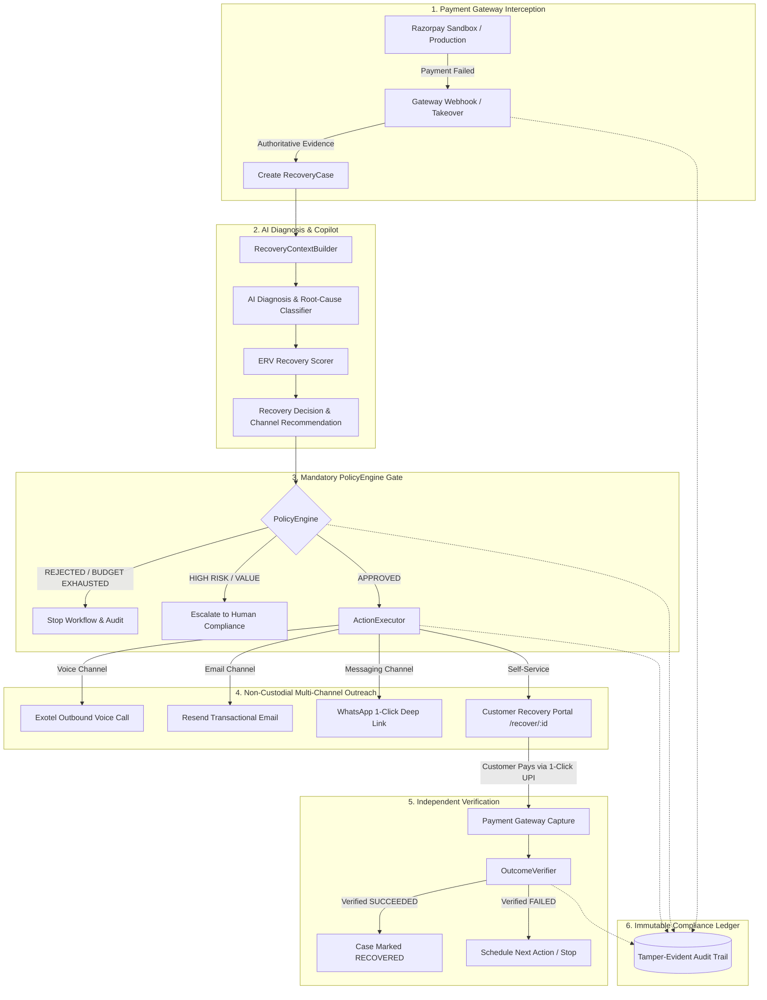

# RevivePay — Intelligent Payment Recovery & Revenue Preservation Engine

RevivePay is an autonomous, policy-gated revenue recovery engine that intercepts payment failures from payment gateways (e.g., Razorpay), diagnoses the root cause using AI, ranks recovery channels by **Expected Recovery Value (ERV)**, and executes non-custodial recovery interventions (Exotel Voice, Resend Email, WhatsApp, and 1-Click UPI links).

---

## 🏛️ Core Architectural Invariant

> **"AI Recommends, PolicyEngine Decides, ActionExecutor Acts, OutcomeVerifier Proves."**

- **Non-Custodial Recovery**: Recovery channels never hold or directly move merchant funds.
- **Strict Separation of Execution and Settlement**: Placing an outbound phone call or delivering an email is **never** counted as revenue recovery. Revenue is strictly marked recovered only when the customer successfully completes payment via the verified recovery portal and `OutcomeVerifier` validates the captured gateway state.
- **Safety & Compliance First**: High-value transactions escalate to human review; exhausted retry budgets are blocked; settled or recovered cases are strictly barred from outbound recovery calls.

---

## 🔄 End-to-End System Architecture



---

## 🧩 Architectural Components

### 1. Gateway Takeover & Telemetry (`app/services/gateway_payment_service.py`)
- Real Razorpay Sandbox integration with HMAC-SHA256 signature verification.
- Ingests gateway error codes (`BAD_REQUEST_ERROR`, `GATEWAY_ERROR`, network drops) and normalizes them into domain failure categories:
  - `BANK_TIMEOUT`: Issuing bank core API downtime.
  - `INSUFFICIENT_FUNDS`: Account balance low; instrument switch required.
  - `EXPIRED_CARD`: Expired or issuer-blocked card.
  - `NETWORK_ERROR`: 3DS session disconnect mid-transaction.

### 2. AI Diagnosis & ERV Calculation (`app/services/copilot.py`, `app/services/expected_recovery.py`)
- **Root-Cause Analysis**: Distinguishes between transient issuer downtimes and terminal payment method defects.
- **Expected Recovery Value (ERV)** calculation:
  $$\text{ERV} = (\text{Amount at Risk} \times P_{\text{recovery}}) - \text{Intervention Cost} - \text{Customer Friction Penalty}$$
- Ranks candidate actions: Outbound Voice, Transactional Email, Instant UPI Link, or Intelligent Retry Delay.

### 3. Mandatory PolicyEngine Gate (`app/services/policy_engine.py`)
- Autonomous actions cannot execute without passing deterministic compliance rules:
  - **Retry Budget Enforcement**: Blocks actions if `attempt_count > max_automatic_retries`.
  - **High-Value Escalation**: Escalates transactions above configured risk thresholds to human agents.
  - **Terminal State Lock**: Rejects outreach on `RECOVERED` or `ESCALATED` cases to avoid customer harassment.
  - **Idempotency Guard**: Prevents concurrent duplicate outreach on active cases.

### 4. Action Execution Engine (`app/services/action_executor.py`, `app/services/voice_recovery.py`)
- **Exotel Voice Channel**: Outbound calls via Exotel Connect API (`exoml/start_voice`) triggering IVR Text-to-Speech explaining the failure and dispatching SMS/WhatsApp links.
- **Resend Email Channel**: Branded transactional emails with 1-click recovery buttons.
- **WhatsApp Channel**: Deep-linked pre-filled messages with recovery links.
- **1-Click Customer Recovery Portal**: Standalone responsive checkout page (`/recover/:case_id`) preserving order context and offering frictionless UPI/card alternatives.

### 5. Authoritative Outcome Verifier (`app/services/outcome_verifier.py`)
- Proves recovery independently by querying the gateway or validating cryptographic checkout callbacks.
- Only marks revenue recovered when authoritative state is `PaymentStatus.SUCCEEDED`.

### 6. Audit & Telemetry (`app/services/audit_service.py`)
- Every workflow milestone generates an append-only audit event with correlation IDs, stage tags, and sanitized metadata.

---

## 💻 Tech Stack

### Backend
- **Framework**: Python 3.11+, FastAPI, Pydantic v2
- **Database & ORM**: SQLAlchemy 2.0, Alembic migrations (SQLite for development, PostgreSQL-ready)
- **External Integrations**:
  - **Razorpay**: Sandbox orders, payments, webhooks, HMAC verification
  - **Exotel**: Outbound telephony, IVR applet flows, status callbacks
  - **Resend**: Transactional email API
- **Testing**: Pytest (66+ unit and integration tests)

### Frontend (Command Center)
- **Framework**: React 19, TypeScript, Vite
- **Styling**: TailwindCSS, Lucide Icons, Glassmorphism aesthetic
- **Key Modules**:
  - **Executive Dashboard**: Real-time recovery rates, recovered revenue, channel distribution.
  - **Recovery Simulator**: 7-stage interactive playground to simulate gateway failures, AI diagnosis, and trigger live Exotel calls, Resend emails, and customer UPI recovery.
  - **Case Detail & Audit Timeline**: Full forensic view with decision explanations and tamper-evident event history.
  - **Strategy Lab**: Side-by-side what-if analysis comparing baseline retries vs. RevivePay ERV intelligence.
  - **Judge / Demo View**: Interactive guided presentation mode for live evaluations.

---

## ⚡ Quickstart

### Prerequisites
- Python 3.11+
- Node.js 18+ & npm

### 1. Backend Setup

```powershell
# Clone and enter directory
cd RevivePay

# Create virtual environment
python -m venv .venv
.\.venv\Scripts\Activate.ps1

# Install dependencies
pip install -r requirements.txt

# Configure environment variables
Copy-Item .env.example .env

# Initialize SQLite database and seed initial synthetic records
python scripts/init_db.py
python scripts/seed.py --reset

# Start FastAPI server
uvicorn app.main:app --reload --port 8000
```
Backend will be available at `http://localhost:8000` (Swagger docs at `http://localhost:8000/docs`).

### 2. Frontend Command Center Setup

```powershell
# In a new terminal:
cd frontend
npm install
npm run dev
```
Open `http://localhost:5173` in your browser.

---

## ⚙️ Environment Configuration (`.env`)

```env
# Database & Core
DATABASE_URL=sqlite:///./revivepay.db
ENVIRONMENT=development
LOG_LEVEL=INFO

# Razorpay Sandbox (Real Gateway Interception)
RAZORPAY_KEY_ID=rzp_test_...
RAZORPAY_KEY_SECRET=...
RAZORPAY_WEBHOOK_SECRET=...

# Exotel Voice Recovery (Real Outbound Calling)
EXOTEL_API_KEY=your_exotel_api_key
EXOTEL_API_PASSWORD=your_exotel_api_token
EXOTEL_ACCOUNT_SID=your_account_sid
EXOTEL_SUBDOMAIN=api.exotel.com
EXOTEL_CALLER_ID=your_exophone_number
EXOTEL_FLOW_ID=your_applet_flow_id

# Resend Transactional Email (Real Email Recovery)
RESEND_API_KEY=re_...
RESEND_FROM_EMAIL=onboarding@resend.dev
```

---

## 🧪 Testing & Verification

Run the comprehensive test suite covering all recovery flows, policy gates, and integrations:

```powershell
# Run all backend unit and integration tests
pytest -q -p no:warnings

# Run frontend typecheck and build validation
cd frontend
npm run typecheck
npm run build
```

---

## 🛡️ License & Compliance Notice

This project is built for demonstrative and commercial recovery integration. Telephony, email, and payment gateway credentials should be kept in git-ignored `.env` files and never committed to version control.
